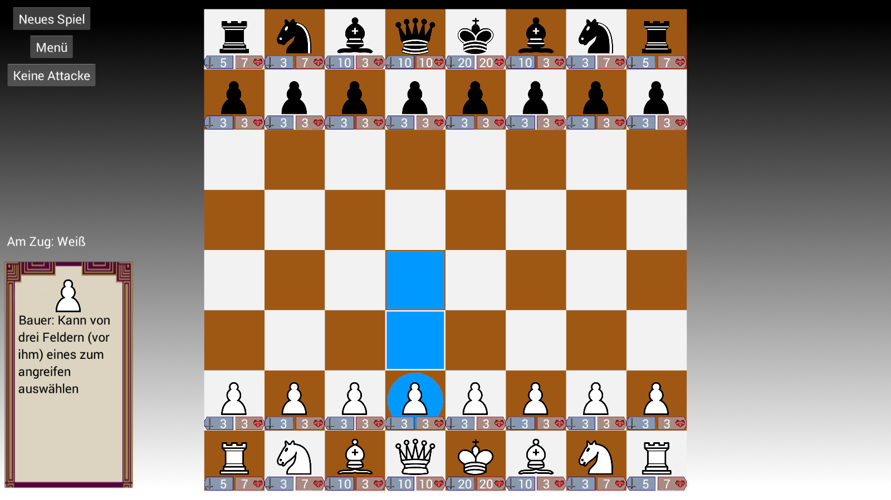
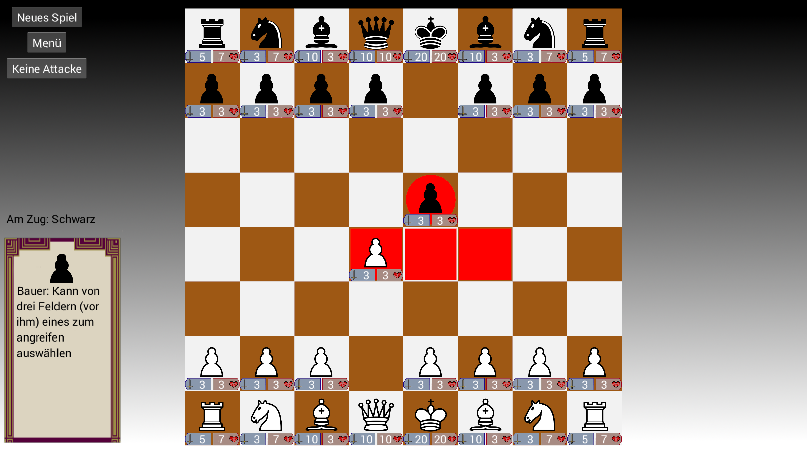
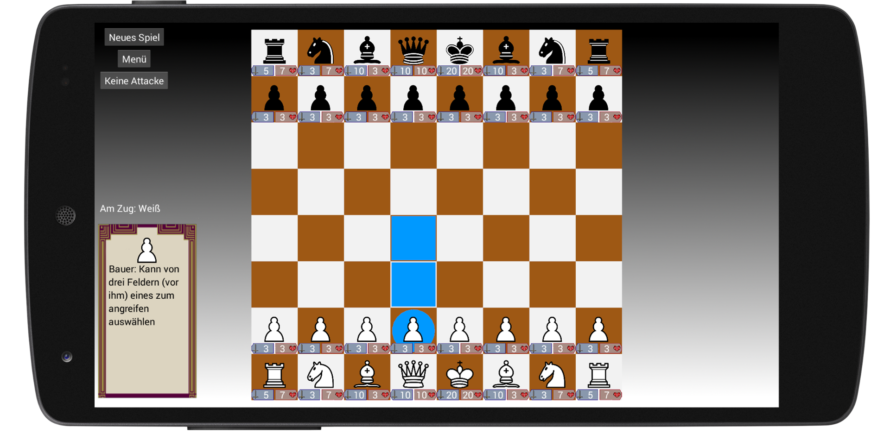

# Beschreibung

Basierend auf dem klassischen Schach bringt dieses Spiel mit der Einteilung des Zuges in Angriffs- und Bewegungsphase eine weitere Ebene der Strategie mit sich.

Die einzelnen Figuren haben verschiedene Angriffs- bzw. Bewegungsmuster und Kampfstärken, die strategisch sinnvoll eingesetzt werden müssen, um den gegnerischen König zu Fall zu bringen.

Über den Online-Modus können Spieler auf unterschiedlichen Geräten und Platformen miteinander spielen.

# Screenshots

